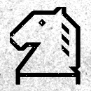

|   | a | b | c | d | e | f | g | h |
|---|---|---|---|---|---|---|---|---|
| 8 |  |  |  |  |  |  |  |  |
| 7 |  |  |  |  |  |  |  |  |
| 6 |  |  |  |  |  |  |  |  |
| 5 |  |  |  |  |  |  |  |  |
| 4 |  |  |  |  |  |  |  |  |
| 3 |  |  |  |  |  |  |  |  |
| 2 |  |  |  |  |  |  |  |  |
| 1 |  |  |  |  |  |  |  |  |
|   | a | b | c | d | e | f | g | h |

| From |  To  |
|------|------|
|  f3  | [b7](https://github.com/tanishq-singh-2407/readme-chess/issues/new?title=chess_move_f3b7&labels=make+move&body=Just+push+%27Submit+new+issue%27.+You+don%27t+need+to+do+anything+else.), [c6](https://github.com/tanishq-singh-2407/readme-chess/issues/new?title=chess_move_f3c6&labels=make+move&body=Just+push+%27Submit+new+issue%27.+You+don%27t+need+to+do+anything+else.), [h5](https://github.com/tanishq-singh-2407/readme-chess/issues/new?title=chess_move_f3h5&labels=make+move&body=Just+push+%27Submit+new+issue%27.+You+don%27t+need+to+do+anything+else.), [d5](https://github.com/tanishq-singh-2407/readme-chess/issues/new?title=chess_move_f3d5&labels=make+move&body=Just+push+%27Submit+new+issue%27.+You+don%27t+need+to+do+anything+else.), [g4](https://github.com/tanishq-singh-2407/readme-chess/issues/new?title=chess_move_f3g4&labels=make+move&body=Just+push+%27Submit+new+issue%27.+You+don%27t+need+to+do+anything+else.), [e4](https://github.com/tanishq-singh-2407/readme-chess/issues/new?title=chess_move_f3e4&labels=make+move&body=Just+push+%27Submit+new+issue%27.+You+don%27t+need+to+do+anything+else.), [e2](https://github.com/tanishq-singh-2407/readme-chess/issues/new?title=chess_move_f3e2&labels=make+move&body=Just+push+%27Submit+new+issue%27.+You+don%27t+need+to+do+anything+else.) |
|  c3  | [d5](https://github.com/tanishq-singh-2407/readme-chess/issues/new?title=chess_move_c3d5&labels=make+move&body=Just+push+%27Submit+new+issue%27.+You+don%27t+need+to+do+anything+else.), [b5](https://github.com/tanishq-singh-2407/readme-chess/issues/new?title=chess_move_c3b5&labels=make+move&body=Just+push+%27Submit+new+issue%27.+You+don%27t+need+to+do+anything+else.), [e4](https://github.com/tanishq-singh-2407/readme-chess/issues/new?title=chess_move_c3e4&labels=make+move&body=Just+push+%27Submit+new+issue%27.+You+don%27t+need+to+do+anything+else.), [a4](https://github.com/tanishq-singh-2407/readme-chess/issues/new?title=chess_move_c3a4&labels=make+move&body=Just+push+%27Submit+new+issue%27.+You+don%27t+need+to+do+anything+else.), [e2](https://github.com/tanishq-singh-2407/readme-chess/issues/new?title=chess_move_c3e2&labels=make+move&body=Just+push+%27Submit+new+issue%27.+You+don%27t+need+to+do+anything+else.) |
|  g1  | [h2](https://github.com/tanishq-singh-2407/readme-chess/issues/new?title=chess_move_g1h2&labels=make+move&body=Just+push+%27Submit+new+issue%27.+You+don%27t+need+to+do+anything+else.), [h1](https://github.com/tanishq-singh-2407/readme-chess/issues/new?title=chess_move_g1h1&labels=make+move&body=Just+push+%27Submit+new+issue%27.+You+don%27t+need+to+do+anything+else.), [f1](https://github.com/tanishq-singh-2407/readme-chess/issues/new?title=chess_move_g1f1&labels=make+move&body=Just+push+%27Submit+new+issue%27.+You+don%27t+need+to+do+anything+else.) |
|  e1  | [e7](https://github.com/tanishq-singh-2407/readme-chess/issues/new?title=chess_move_e1e7&labels=make+move&body=Just+push+%27Submit+new+issue%27.+You+don%27t+need+to+do+anything+else.), [e6](https://github.com/tanishq-singh-2407/readme-chess/issues/new?title=chess_move_e1e6&labels=make+move&body=Just+push+%27Submit+new+issue%27.+You+don%27t+need+to+do+anything+else.), [e5](https://github.com/tanishq-singh-2407/readme-chess/issues/new?title=chess_move_e1e5&labels=make+move&body=Just+push+%27Submit+new+issue%27.+You+don%27t+need+to+do+anything+else.), [e4](https://github.com/tanishq-singh-2407/readme-chess/issues/new?title=chess_move_e1e4&labels=make+move&body=Just+push+%27Submit+new+issue%27.+You+don%27t+need+to+do+anything+else.), [e3](https://github.com/tanishq-singh-2407/readme-chess/issues/new?title=chess_move_e1e3&labels=make+move&body=Just+push+%27Submit+new+issue%27.+You+don%27t+need+to+do+anything+else.), [e2](https://github.com/tanishq-singh-2407/readme-chess/issues/new?title=chess_move_e1e2&labels=make+move&body=Just+push+%27Submit+new+issue%27.+You+don%27t+need+to+do+anything+else.), [f1](https://github.com/tanishq-singh-2407/readme-chess/issues/new?title=chess_move_e1f1&labels=make+move&body=Just+push+%27Submit+new+issue%27.+You+don%27t+need+to+do+anything+else.) |
|  d1  | [a4](https://github.com/tanishq-singh-2407/readme-chess/issues/new?title=chess_move_d1a4&labels=make+move&body=Just+push+%27Submit+new+issue%27.+You+don%27t+need+to+do+anything+else.), [b3](https://github.com/tanishq-singh-2407/readme-chess/issues/new?title=chess_move_d1b3&labels=make+move&body=Just+push+%27Submit+new+issue%27.+You+don%27t+need+to+do+anything+else.), [e2](https://github.com/tanishq-singh-2407/readme-chess/issues/new?title=chess_move_d1e2&labels=make+move&body=Just+push+%27Submit+new+issue%27.+You+don%27t+need+to+do+anything+else.), [c2](https://github.com/tanishq-singh-2407/readme-chess/issues/new?title=chess_move_d1c2&labels=make+move&body=Just+push+%27Submit+new+issue%27.+You+don%27t+need+to+do+anything+else.) |
|  b1  | [a1](https://github.com/tanishq-singh-2407/readme-chess/issues/new?title=chess_move_b1a1&labels=make+move&body=Just+push+%27Submit+new+issue%27.+You+don%27t+need+to+do+anything+else.) |
|  h3  | [h4](https://github.com/tanishq-singh-2407/readme-chess/issues/new?title=chess_move_h3h4&labels=make+move&body=Just+push+%27Submit+new+issue%27.+You+don%27t+need+to+do+anything+else.) |
|  g2  | [g3](https://github.com/tanishq-singh-2407/readme-chess/issues/new?title=chess_move_g2g3&labels=make+move&body=Just+push+%27Submit+new+issue%27.+You+don%27t+need+to+do+anything+else.), [g4](https://github.com/tanishq-singh-2407/readme-chess/issues/new?title=chess_move_g2g4&labels=make+move&body=Just+push+%27Submit+new+issue%27.+You+don%27t+need+to+do+anything+else.) |
|  b2  | [b3](https://github.com/tanishq-singh-2407/readme-chess/issues/new?title=chess_move_b2b3&labels=make+move&body=Just+push+%27Submit+new+issue%27.+You+don%27t+need+to+do+anything+else.), [b4](https://github.com/tanishq-singh-2407/readme-chess/issues/new?title=chess_move_b2b4&labels=make+move&body=Just+push+%27Submit+new+issue%27.+You+don%27t+need+to+do+anything+else.) |
|  a2  | [a3](https://github.com/tanishq-singh-2407/readme-chess/issues/new?title=chess_move_a2a3&labels=make+move&body=Just+push+%27Submit+new+issue%27.+You+don%27t+need+to+do+anything+else.), [a4](https://github.com/tanishq-singh-2407/readme-chess/issues/new?title=chess_move_a2a4&labels=make+move&body=Just+push+%27Submit+new+issue%27.+You+don%27t+need+to+do+anything+else.) |

|||_Human_||||_Stockfish_||
|-|-|:-:|-|:-:|:-:|:-:|:-:|
|**No**|**Date and Time**|**Profile Pic**|**Username**|**From**|**To**|**From**|**To**|
|1|`09/07/25`, `08:30:13`| | [`iegik`](https://github.com/iegik)|`f1`|`e1`|`e5`|`d3`|
|2|`09/07/25`, `08:27:38`| | [`iegik`](https://github.com/iegik)|`e2`|`f3`|`d7`|`d6`|
|3|`09/07/25`, `08:24:39`| | [`iegik`](https://github.com/iegik)|`a1`|`b1`|`c6`|`e5`|
|4|`09/07/25`, `08:22:46`| | [`iegik`](https://github.com/iegik)|`h2`|`h3`|`a7`|`a6`|
|5|`09/07/25`, `08:20:30`| | [`iegik`](https://github.com/iegik)|`b1`|`c3`|`h6`|`f5`|

| game | count |
|------|-------|
| humans | 0 |
| stockfish | 2 |
| draw | 0 |

