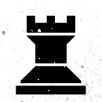
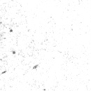
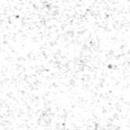
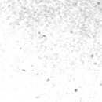
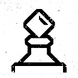
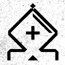
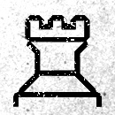

|   | a | b | c | d | e | f | g | h |
|---|---|---|---|---|---|---|---|---|
| 8 |  |  |  |  |  |  |  |  |
| 7 |  |  |  |  |  |  |  |  |
| 6 |  |  |  |  |  |  |  |  |
| 5 |  |  |  |  |  |  |  |  |
| 4 |  |  |  |  |  |  |  |  |
| 3 |  |  |  |  |  |  |  |  |
| 2 |  |  |  |  |  |  |  |  |
| 1 |  |  |  |  |  |  |  |  |
|   | a | b | c | d | e | f | g | h |

| From |  To  |
|------|------|
|  h2  | [h1](https://github.com/tanishq-singh-2407/readme-chess/issues/new?title=chess_move_h2h1&labels=make+move&body=Just+push+%27Submit+new+issue%27.+You+don%27t+need+to+do+anything+else.) |
|  g2  | [e4](https://github.com/tanishq-singh-2407/readme-chess/issues/new?title=chess_move_g2e4&labels=make+move&body=Just+push+%27Submit+new+issue%27.+You+don%27t+need+to+do+anything+else.), [f3](https://github.com/tanishq-singh-2407/readme-chess/issues/new?title=chess_move_g2f3&labels=make+move&body=Just+push+%27Submit+new+issue%27.+You+don%27t+need+to+do+anything+else.), [h1](https://github.com/tanishq-singh-2407/readme-chess/issues/new?title=chess_move_g2h1&labels=make+move&body=Just+push+%27Submit+new+issue%27.+You+don%27t+need+to+do+anything+else.), [f1](https://github.com/tanishq-singh-2407/readme-chess/issues/new?title=chess_move_g2f1&labels=make+move&body=Just+push+%27Submit+new+issue%27.+You+don%27t+need+to+do+anything+else.) |
|  e2  | [h5](https://github.com/tanishq-singh-2407/readme-chess/issues/new?title=chess_move_e2h5&labels=make+move&body=Just+push+%27Submit+new+issue%27.+You+don%27t+need+to+do+anything+else.), [g4](https://github.com/tanishq-singh-2407/readme-chess/issues/new?title=chess_move_e2g4&labels=make+move&body=Just+push+%27Submit+new+issue%27.+You+don%27t+need+to+do+anything+else.), [e4](https://github.com/tanishq-singh-2407/readme-chess/issues/new?title=chess_move_e2e4&labels=make+move&body=Just+push+%27Submit+new+issue%27.+You+don%27t+need+to+do+anything+else.), [f3](https://github.com/tanishq-singh-2407/readme-chess/issues/new?title=chess_move_e2f3&labels=make+move&body=Just+push+%27Submit+new+issue%27.+You+don%27t+need+to+do+anything+else.), [e3](https://github.com/tanishq-singh-2407/readme-chess/issues/new?title=chess_move_e2e3&labels=make+move&body=Just+push+%27Submit+new+issue%27.+You+don%27t+need+to+do+anything+else.), [d2](https://github.com/tanishq-singh-2407/readme-chess/issues/new?title=chess_move_e2d2&labels=make+move&body=Just+push+%27Submit+new+issue%27.+You+don%27t+need+to+do+anything+else.), [f1](https://github.com/tanishq-singh-2407/readme-chess/issues/new?title=chess_move_e2f1&labels=make+move&body=Just+push+%27Submit+new+issue%27.+You+don%27t+need+to+do+anything+else.), [d1](https://github.com/tanishq-singh-2407/readme-chess/issues/new?title=chess_move_e2d1&labels=make+move&body=Just+push+%27Submit+new+issue%27.+You+don%27t+need+to+do+anything+else.) |
|  e1  | [d2](https://github.com/tanishq-singh-2407/readme-chess/issues/new?title=chess_move_e1d2&labels=make+move&body=Just+push+%27Submit+new+issue%27.+You+don%27t+need+to+do+anything+else.), [f1](https://github.com/tanishq-singh-2407/readme-chess/issues/new?title=chess_move_e1f1&labels=make+move&body=Just+push+%27Submit+new+issue%27.+You+don%27t+need+to+do+anything+else.), [d1](https://github.com/tanishq-singh-2407/readme-chess/issues/new?title=chess_move_e1d1&labels=make+move&body=Just+push+%27Submit+new+issue%27.+You+don%27t+need+to+do+anything+else.) |
|  c1  | [h6](https://github.com/tanishq-singh-2407/readme-chess/issues/new?title=chess_move_c1h6&labels=make+move&body=Just+push+%27Submit+new+issue%27.+You+don%27t+need+to+do+anything+else.), [g5](https://github.com/tanishq-singh-2407/readme-chess/issues/new?title=chess_move_c1g5&labels=make+move&body=Just+push+%27Submit+new+issue%27.+You+don%27t+need+to+do+anything+else.), [f4](https://github.com/tanishq-singh-2407/readme-chess/issues/new?title=chess_move_c1f4&labels=make+move&body=Just+push+%27Submit+new+issue%27.+You+don%27t+need+to+do+anything+else.), [e3](https://github.com/tanishq-singh-2407/readme-chess/issues/new?title=chess_move_c1e3&labels=make+move&body=Just+push+%27Submit+new+issue%27.+You+don%27t+need+to+do+anything+else.), [d2](https://github.com/tanishq-singh-2407/readme-chess/issues/new?title=chess_move_c1d2&labels=make+move&body=Just+push+%27Submit+new+issue%27.+You+don%27t+need+to+do+anything+else.) |
|  a1  | [b1](https://github.com/tanishq-singh-2407/readme-chess/issues/new?title=chess_move_a1b1&labels=make+move&body=Just+push+%27Submit+new+issue%27.+You+don%27t+need+to+do+anything+else.) |
|  d3  | [e4](https://github.com/tanishq-singh-2407/readme-chess/issues/new?title=chess_move_d3e4&labels=make+move&body=Just+push+%27Submit+new+issue%27.+You+don%27t+need+to+do+anything+else.), [d4](https://github.com/tanishq-singh-2407/readme-chess/issues/new?title=chess_move_d3d4&labels=make+move&body=Just+push+%27Submit+new+issue%27.+You+don%27t+need+to+do+anything+else.) |
|  h3  | [h4](https://github.com/tanishq-singh-2407/readme-chess/issues/new?title=chess_move_h3h4&labels=make+move&body=Just+push+%27Submit+new+issue%27.+You+don%27t+need+to+do+anything+else.) |
|  g3  | [g4](https://github.com/tanishq-singh-2407/readme-chess/issues/new?title=chess_move_g3g4&labels=make+move&body=Just+push+%27Submit+new+issue%27.+You+don%27t+need+to+do+anything+else.) |
|  f2  | [f3](https://github.com/tanishq-singh-2407/readme-chess/issues/new?title=chess_move_f2f3&labels=make+move&body=Just+push+%27Submit+new+issue%27.+You+don%27t+need+to+do+anything+else.), [f4](https://github.com/tanishq-singh-2407/readme-chess/issues/new?title=chess_move_f2f4&labels=make+move&body=Just+push+%27Submit+new+issue%27.+You+don%27t+need+to+do+anything+else.) |
|  c2  | [c3](https://github.com/tanishq-singh-2407/readme-chess/issues/new?title=chess_move_c2c3&labels=make+move&body=Just+push+%27Submit+new+issue%27.+You+don%27t+need+to+do+anything+else.), [c4](https://github.com/tanishq-singh-2407/readme-chess/issues/new?title=chess_move_c2c4&labels=make+move&body=Just+push+%27Submit+new+issue%27.+You+don%27t+need+to+do+anything+else.) |
|  b2  | [b3](https://github.com/tanishq-singh-2407/readme-chess/issues/new?title=chess_move_b2b3&labels=make+move&body=Just+push+%27Submit+new+issue%27.+You+don%27t+need+to+do+anything+else.), [b4](https://github.com/tanishq-singh-2407/readme-chess/issues/new?title=chess_move_b2b4&labels=make+move&body=Just+push+%27Submit+new+issue%27.+You+don%27t+need+to+do+anything+else.) |
|  a2  | [a3](https://github.com/tanishq-singh-2407/readme-chess/issues/new?title=chess_move_a2a3&labels=make+move&body=Just+push+%27Submit+new+issue%27.+You+don%27t+need+to+do+anything+else.), [a4](https://github.com/tanishq-singh-2407/readme-chess/issues/new?title=chess_move_a2a4&labels=make+move&body=Just+push+%27Submit+new+issue%27.+You+don%27t+need+to+do+anything+else.) |

|||_Human_||||_Stockfish_||
|-|-|:-:|-|:-:|:-:|:-:|:-:|
|**No**|**Date and Time**|**Profile Pic**|**Username**|**From**|**To**|**From**|**To**|
|1|`09/07/25`, `09:10:45`| | [`iegik`](https://github.com/iegik)|`d2`|`d3`|`f8`|`d6`|
|2|`09/07/25`, `09:08:31`| | [`iegik`](https://github.com/iegik)|`d1`|`e2`|`g8`|`f6`|
|3|`09/07/25`, `09:07:11`| | [`iegik`](https://github.com/iegik)|`f1`|`g2`|`f7`|`f5`|
|4|`09/07/25`, `09:04:17`| | [`iegik`](https://github.com/iegik)|`b5`|`c7`|`e5`|`c7`|
|5|`09/07/25`, `09:01:38`| | [`iegik`](https://github.com/iegik)|`g2`|`g3`|`c7`|`c6`|

| game | count |
|------|-------|
| humans | 0 |
| stockfish | 3 |
| draw | 0 |

