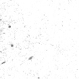
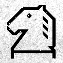

|   | a | b | c | d | e | f | g | h |
|---|---|---|---|---|---|---|---|---|
| 8 |  |  |  |  |  |  |  |  |
| 7 |  |  |  |  |  |  |  |  |
| 6 |  |  |  |  |  |  |  |  |
| 5 |  |  |  |  |  |  |  |  |
| 4 |  |  |  |  |  |  |  |  |
| 3 |  |  |  |  |  |  |  |  |
| 2 |  |  |  |  |  |  |  |  |
| 1 |  |  |  |  |  |  |  |  |
|   | a | b | c | d | e | f | g | h |

| From |  To  |
|------|------|
|  c3  | [d2](https://github.com/tanishq-singh-2407/readme-chess/issues/new?title=chess_move_c3d2&labels=make+move&body=Just+push+%27Submit+new+issue%27.+You+don%27t+need+to+do+anything+else.), [b2](https://github.com/tanishq-singh-2407/readme-chess/issues/new?title=chess_move_c3b2&labels=make+move&body=Just+push+%27Submit+new+issue%27.+You+don%27t+need+to+do+anything+else.) |
|  c2  | [d4](https://github.com/tanishq-singh-2407/readme-chess/issues/new?title=chess_move_c2d4&labels=make+move&body=Just+push+%27Submit+new+issue%27.+You+don%27t+need+to+do+anything+else.), [b4](https://github.com/tanishq-singh-2407/readme-chess/issues/new?title=chess_move_c2b4&labels=make+move&body=Just+push+%27Submit+new+issue%27.+You+don%27t+need+to+do+anything+else.), [e3](https://github.com/tanishq-singh-2407/readme-chess/issues/new?title=chess_move_c2e3&labels=make+move&body=Just+push+%27Submit+new+issue%27.+You+don%27t+need+to+do+anything+else.), [a3](https://github.com/tanishq-singh-2407/readme-chess/issues/new?title=chess_move_c2a3&labels=make+move&body=Just+push+%27Submit+new+issue%27.+You+don%27t+need+to+do+anything+else.), [e1](https://github.com/tanishq-singh-2407/readme-chess/issues/new?title=chess_move_c2e1&labels=make+move&body=Just+push+%27Submit+new+issue%27.+You+don%27t+need+to+do+anything+else.), [a1](https://github.com/tanishq-singh-2407/readme-chess/issues/new?title=chess_move_c2a1&labels=make+move&body=Just+push+%27Submit+new+issue%27.+You+don%27t+need+to+do+anything+else.) |

|||_Human_||||_Stockfish_||
|-|-|:-:|-|:-:|:-:|:-:|:-:|
|**No**|**Date and Time**|**Profile Pic**|**Username**|**From**|**To**|**From**|**To**|
|1|`11/04/26`, `04:29:44`| | [`tadanobutubutu`](https://github.com/tadanobutubutu)|`e3`|`c2`|`b5`|`c5`|
|2|`11/04/26`, `04:24:47`| | [`tadanobutubutu`](https://github.com/tadanobutubutu)|`d5`|`e3`|`c5`|`c4`|
|3|`11/04/26`, `04:19:40`| | [`tadanobutubutu`](https://github.com/tadanobutubutu)|`f6`|`d5`|`a5`|`a4`|
|4|`11/04/26`, `04:14:39`| | [`tadanobutubutu`](https://github.com/tadanobutubutu)|`d7`|`f6`|`a7`|`a5`|
|5|`11/04/26`, `04:09:37`| | [`tadanobutubutu`](https://github.com/tadanobutubutu)|`c4`|`b5`|`a5`|`b5`|

| game | count |
|------|-------|
| humans | 0 |
| stockfish | 8 |
| draw | 0 |

