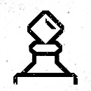

|   | a | b | c | d | e | f | g | h |
|---|---|---|---|---|---|---|---|---|
| 8 |  |  |  |  |  |  |  |  |
| 7 |  |  |  |  |  |  |  |  |
| 6 |  |  |  |  |  |  |  |  |
| 5 |  |  |  |  |  |  |  |  |
| 4 |  |  |  |  |  |  |  |  |
| 3 |  |  |  |  |  |  |  |  |
| 2 |  |  |  |  |  |  |  |  |
| 1 |  |  |  |  |  |  |  |  |
|   | a | b | c | d | e | f | g | h |

| From |  To  |
|------|------|
|  e4  | [f6](https://github.com/tanishq-singh-2407/readme-chess/issues/new?title=chess_move_e4f6&labels=make+move&body=Just+push+%27Submit+new+issue%27.+You+don%27t+need+to+do+anything+else.), [d6](https://github.com/tanishq-singh-2407/readme-chess/issues/new?title=chess_move_e4d6&labels=make+move&body=Just+push+%27Submit+new+issue%27.+You+don%27t+need+to+do+anything+else.), [g5](https://github.com/tanishq-singh-2407/readme-chess/issues/new?title=chess_move_e4g5&labels=make+move&body=Just+push+%27Submit+new+issue%27.+You+don%27t+need+to+do+anything+else.), [c5](https://github.com/tanishq-singh-2407/readme-chess/issues/new?title=chess_move_e4c5&labels=make+move&body=Just+push+%27Submit+new+issue%27.+You+don%27t+need+to+do+anything+else.), [c3](https://github.com/tanishq-singh-2407/readme-chess/issues/new?title=chess_move_e4c3&labels=make+move&body=Just+push+%27Submit+new+issue%27.+You+don%27t+need+to+do+anything+else.), [f2](https://github.com/tanishq-singh-2407/readme-chess/issues/new?title=chess_move_e4f2&labels=make+move&body=Just+push+%27Submit+new+issue%27.+You+don%27t+need+to+do+anything+else.), [d2](https://github.com/tanishq-singh-2407/readme-chess/issues/new?title=chess_move_e4d2&labels=make+move&body=Just+push+%27Submit+new+issue%27.+You+don%27t+need+to+do+anything+else.) |
|  e3  | [d4](https://github.com/tanishq-singh-2407/readme-chess/issues/new?title=chess_move_e3d4&labels=make+move&body=Just+push+%27Submit+new+issue%27.+You+don%27t+need+to+do+anything+else.), [f3](https://github.com/tanishq-singh-2407/readme-chess/issues/new?title=chess_move_e3f3&labels=make+move&body=Just+push+%27Submit+new+issue%27.+You+don%27t+need+to+do+anything+else.), [d3](https://github.com/tanishq-singh-2407/readme-chess/issues/new?title=chess_move_e3d3&labels=make+move&body=Just+push+%27Submit+new+issue%27.+You+don%27t+need+to+do+anything+else.), [f2](https://github.com/tanishq-singh-2407/readme-chess/issues/new?title=chess_move_e3f2&labels=make+move&body=Just+push+%27Submit+new+issue%27.+You+don%27t+need+to+do+anything+else.), [e2](https://github.com/tanishq-singh-2407/readme-chess/issues/new?title=chess_move_e3e2&labels=make+move&body=Just+push+%27Submit+new+issue%27.+You+don%27t+need+to+do+anything+else.), [d2](https://github.com/tanishq-singh-2407/readme-chess/issues/new?title=chess_move_e3d2&labels=make+move&body=Just+push+%27Submit+new+issue%27.+You+don%27t+need+to+do+anything+else.) |
|  f4  | [f5](https://github.com/tanishq-singh-2407/readme-chess/issues/new?title=chess_move_f4f5&labels=make+move&body=Just+push+%27Submit+new+issue%27.+You+don%27t+need+to+do+anything+else.) |
|  h3  | [h4](https://github.com/tanishq-singh-2407/readme-chess/issues/new?title=chess_move_h3h4&labels=make+move&body=Just+push+%27Submit+new+issue%27.+You+don%27t+need+to+do+anything+else.) |
|  g3  | [g4](https://github.com/tanishq-singh-2407/readme-chess/issues/new?title=chess_move_g3g4&labels=make+move&body=Just+push+%27Submit+new+issue%27.+You+don%27t+need+to+do+anything+else.) |
|  c2  | [c3](https://github.com/tanishq-singh-2407/readme-chess/issues/new?title=chess_move_c2c3&labels=make+move&body=Just+push+%27Submit+new+issue%27.+You+don%27t+need+to+do+anything+else.), [c4](https://github.com/tanishq-singh-2407/readme-chess/issues/new?title=chess_move_c2c4&labels=make+move&body=Just+push+%27Submit+new+issue%27.+You+don%27t+need+to+do+anything+else.) |
|  b2  | [b3](https://github.com/tanishq-singh-2407/readme-chess/issues/new?title=chess_move_b2b3&labels=make+move&body=Just+push+%27Submit+new+issue%27.+You+don%27t+need+to+do+anything+else.), [b4](https://github.com/tanishq-singh-2407/readme-chess/issues/new?title=chess_move_b2b4&labels=make+move&body=Just+push+%27Submit+new+issue%27.+You+don%27t+need+to+do+anything+else.) |

|||_Human_||||_Stockfish_||
|-|-|:-:|-|:-:|:-:|:-:|:-:|
|**No**|**Date and Time**|**Profile Pic**|**Username**|**From**|**To**|**From**|**To**|
|1|`10/04/26`, `21:26:10`| | [`tadanobutubutu`](https://github.com/tadanobutubutu)|`g2`|`g3`|`f7`|`f6`|
|2|`10/04/26`, `21:25:18`| | [`tadanobutubutu`](https://github.com/tadanobutubutu)|`d2`|`e3`|`h7`|`h5`|
|3|`10/04/26`, `21:24:29`| | [`tadanobutubutu`](https://github.com/tadanobutubutu)|`c1`|`d2`|`e8`|`g7`|
|4|`10/04/26`, `21:23:42`| | [`tadanobutubutu`](https://github.com/tadanobutubutu)|`c3`|`e4`|`f8`|`e7`|
|5|`10/04/26`, `21:23:01`| | [`tadanobutubutu`](https://github.com/tadanobutubutu)|`e1`|`e8`|`f6`|`e8`|

| game | count |
|------|-------|
| humans | 0 |
| stockfish | 7 |
| draw | 0 |

