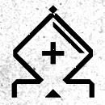

|   | a | b | c | d | e | f | g | h |
|---|---|---|---|---|---|---|---|---|
| 8 |  |  |  |  |  |  |  |  |
| 7 |  |  |  |  |  |  |  |  |
| 6 |  |  |  |  |  |  |  |  |
| 5 |  |  |  |  |  |  |  |  |
| 4 |  |  |  |  |  |  |  |  |
| 3 |  |  |  |  |  |  |  |  |
| 2 |  |  |  |  |  |  |  |  |
| 1 |  |  |  |  |  |  |  |  |
|   | a | b | c | d | e | f | g | h |

| From |  To  |
|------|------|
|  e3  | [a7](https://github.com/tanishq-singh-2407/readme-chess/issues/new?title=chess_move_e3a7&labels=make+move&body=Just+push+%27Submit+new+issue%27.+You+don%27t+need+to+do+anything+else.), [h6](https://github.com/tanishq-singh-2407/readme-chess/issues/new?title=chess_move_e3h6&labels=make+move&body=Just+push+%27Submit+new+issue%27.+You+don%27t+need+to+do+anything+else.), [b6](https://github.com/tanishq-singh-2407/readme-chess/issues/new?title=chess_move_e3b6&labels=make+move&body=Just+push+%27Submit+new+issue%27.+You+don%27t+need+to+do+anything+else.), [g5](https://github.com/tanishq-singh-2407/readme-chess/issues/new?title=chess_move_e3g5&labels=make+move&body=Just+push+%27Submit+new+issue%27.+You+don%27t+need+to+do+anything+else.), [c5](https://github.com/tanishq-singh-2407/readme-chess/issues/new?title=chess_move_e3c5&labels=make+move&body=Just+push+%27Submit+new+issue%27.+You+don%27t+need+to+do+anything+else.), [f4](https://github.com/tanishq-singh-2407/readme-chess/issues/new?title=chess_move_e3f4&labels=make+move&body=Just+push+%27Submit+new+issue%27.+You+don%27t+need+to+do+anything+else.), [d4](https://github.com/tanishq-singh-2407/readme-chess/issues/new?title=chess_move_e3d4&labels=make+move&body=Just+push+%27Submit+new+issue%27.+You+don%27t+need+to+do+anything+else.), [d2](https://github.com/tanishq-singh-2407/readme-chess/issues/new?title=chess_move_e3d2&labels=make+move&body=Just+push+%27Submit+new+issue%27.+You+don%27t+need+to+do+anything+else.), [c1](https://github.com/tanishq-singh-2407/readme-chess/issues/new?title=chess_move_e3c1&labels=make+move&body=Just+push+%27Submit+new+issue%27.+You+don%27t+need+to+do+anything+else.) |
|  c3  | [d5](https://github.com/tanishq-singh-2407/readme-chess/issues/new?title=chess_move_c3d5&labels=make+move&body=Just+push+%27Submit+new+issue%27.+You+don%27t+need+to+do+anything+else.), [b5](https://github.com/tanishq-singh-2407/readme-chess/issues/new?title=chess_move_c3b5&labels=make+move&body=Just+push+%27Submit+new+issue%27.+You+don%27t+need+to+do+anything+else.), [e4](https://github.com/tanishq-singh-2407/readme-chess/issues/new?title=chess_move_c3e4&labels=make+move&body=Just+push+%27Submit+new+issue%27.+You+don%27t+need+to+do+anything+else.), [a4](https://github.com/tanishq-singh-2407/readme-chess/issues/new?title=chess_move_c3a4&labels=make+move&body=Just+push+%27Submit+new+issue%27.+You+don%27t+need+to+do+anything+else.), [e2](https://github.com/tanishq-singh-2407/readme-chess/issues/new?title=chess_move_c3e2&labels=make+move&body=Just+push+%27Submit+new+issue%27.+You+don%27t+need+to+do+anything+else.), [b1](https://github.com/tanishq-singh-2407/readme-chess/issues/new?title=chess_move_c3b1&labels=make+move&body=Just+push+%27Submit+new+issue%27.+You+don%27t+need+to+do+anything+else.) |
|  h1  | [g1](https://github.com/tanishq-singh-2407/readme-chess/issues/new?title=chess_move_h1g1&labels=make+move&body=Just+push+%27Submit+new+issue%27.+You+don%27t+need+to+do+anything+else.) |
|  f1  | [a6](https://github.com/tanishq-singh-2407/readme-chess/issues/new?title=chess_move_f1a6&labels=make+move&body=Just+push+%27Submit+new+issue%27.+You+don%27t+need+to+do+anything+else.), [b5](https://github.com/tanishq-singh-2407/readme-chess/issues/new?title=chess_move_f1b5&labels=make+move&body=Just+push+%27Submit+new+issue%27.+You+don%27t+need+to+do+anything+else.), [c4](https://github.com/tanishq-singh-2407/readme-chess/issues/new?title=chess_move_f1c4&labels=make+move&body=Just+push+%27Submit+new+issue%27.+You+don%27t+need+to+do+anything+else.), [d3](https://github.com/tanishq-singh-2407/readme-chess/issues/new?title=chess_move_f1d3&labels=make+move&body=Just+push+%27Submit+new+issue%27.+You+don%27t+need+to+do+anything+else.), [e2](https://github.com/tanishq-singh-2407/readme-chess/issues/new?title=chess_move_f1e2&labels=make+move&body=Just+push+%27Submit+new+issue%27.+You+don%27t+need+to+do+anything+else.) |
|  e1  | [e2](https://github.com/tanishq-singh-2407/readme-chess/issues/new?title=chess_move_e1e2&labels=make+move&body=Just+push+%27Submit+new+issue%27.+You+don%27t+need+to+do+anything+else.), [d2](https://github.com/tanishq-singh-2407/readme-chess/issues/new?title=chess_move_e1d2&labels=make+move&body=Just+push+%27Submit+new+issue%27.+You+don%27t+need+to+do+anything+else.) |
|  d1  | [d7](https://github.com/tanishq-singh-2407/readme-chess/issues/new?title=chess_move_d1d7&labels=make+move&body=Just+push+%27Submit+new+issue%27.+You+don%27t+need+to+do+anything+else.), [d6](https://github.com/tanishq-singh-2407/readme-chess/issues/new?title=chess_move_d1d6&labels=make+move&body=Just+push+%27Submit+new+issue%27.+You+don%27t+need+to+do+anything+else.), [h5](https://github.com/tanishq-singh-2407/readme-chess/issues/new?title=chess_move_d1h5&labels=make+move&body=Just+push+%27Submit+new+issue%27.+You+don%27t+need+to+do+anything+else.), [d5](https://github.com/tanishq-singh-2407/readme-chess/issues/new?title=chess_move_d1d5&labels=make+move&body=Just+push+%27Submit+new+issue%27.+You+don%27t+need+to+do+anything+else.), [g4](https://github.com/tanishq-singh-2407/readme-chess/issues/new?title=chess_move_d1g4&labels=make+move&body=Just+push+%27Submit+new+issue%27.+You+don%27t+need+to+do+anything+else.), [d4](https://github.com/tanishq-singh-2407/readme-chess/issues/new?title=chess_move_d1d4&labels=make+move&body=Just+push+%27Submit+new+issue%27.+You+don%27t+need+to+do+anything+else.), [f3](https://github.com/tanishq-singh-2407/readme-chess/issues/new?title=chess_move_d1f3&labels=make+move&body=Just+push+%27Submit+new+issue%27.+You+don%27t+need+to+do+anything+else.), [d3](https://github.com/tanishq-singh-2407/readme-chess/issues/new?title=chess_move_d1d3&labels=make+move&body=Just+push+%27Submit+new+issue%27.+You+don%27t+need+to+do+anything+else.), [e2](https://github.com/tanishq-singh-2407/readme-chess/issues/new?title=chess_move_d1e2&labels=make+move&body=Just+push+%27Submit+new+issue%27.+You+don%27t+need+to+do+anything+else.), [d2](https://github.com/tanishq-singh-2407/readme-chess/issues/new?title=chess_move_d1d2&labels=make+move&body=Just+push+%27Submit+new+issue%27.+You+don%27t+need+to+do+anything+else.), [c1](https://github.com/tanishq-singh-2407/readme-chess/issues/new?title=chess_move_d1c1&labels=make+move&body=Just+push+%27Submit+new+issue%27.+You+don%27t+need+to+do+anything+else.), [b1](https://github.com/tanishq-singh-2407/readme-chess/issues/new?title=chess_move_d1b1&labels=make+move&body=Just+push+%27Submit+new+issue%27.+You+don%27t+need+to+do+anything+else.) |
|  a1  | [c1](https://github.com/tanishq-singh-2407/readme-chess/issues/new?title=chess_move_a1c1&labels=make+move&body=Just+push+%27Submit+new+issue%27.+You+don%27t+need+to+do+anything+else.), [b1](https://github.com/tanishq-singh-2407/readme-chess/issues/new?title=chess_move_a1b1&labels=make+move&body=Just+push+%27Submit+new+issue%27.+You+don%27t+need+to+do+anything+else.) |
|  e5  | [e6](https://github.com/tanishq-singh-2407/readme-chess/issues/new?title=chess_move_e5e6&labels=make+move&body=Just+push+%27Submit+new+issue%27.+You+don%27t+need+to+do+anything+else.) |
|  h2  | [h3](https://github.com/tanishq-singh-2407/readme-chess/issues/new?title=chess_move_h2h3&labels=make+move&body=Just+push+%27Submit+new+issue%27.+You+don%27t+need+to+do+anything+else.), [h4](https://github.com/tanishq-singh-2407/readme-chess/issues/new?title=chess_move_h2h4&labels=make+move&body=Just+push+%27Submit+new+issue%27.+You+don%27t+need+to+do+anything+else.) |
|  g2  | [g3](https://github.com/tanishq-singh-2407/readme-chess/issues/new?title=chess_move_g2g3&labels=make+move&body=Just+push+%27Submit+new+issue%27.+You+don%27t+need+to+do+anything+else.), [g4](https://github.com/tanishq-singh-2407/readme-chess/issues/new?title=chess_move_g2g4&labels=make+move&body=Just+push+%27Submit+new+issue%27.+You+don%27t+need+to+do+anything+else.) |
|  f2  | [f3](https://github.com/tanishq-singh-2407/readme-chess/issues/new?title=chess_move_f2f3&labels=make+move&body=Just+push+%27Submit+new+issue%27.+You+don%27t+need+to+do+anything+else.), [f4](https://github.com/tanishq-singh-2407/readme-chess/issues/new?title=chess_move_f2f4&labels=make+move&body=Just+push+%27Submit+new+issue%27.+You+don%27t+need+to+do+anything+else.) |
|  b2  | [b3](https://github.com/tanishq-singh-2407/readme-chess/issues/new?title=chess_move_b2b3&labels=make+move&body=Just+push+%27Submit+new+issue%27.+You+don%27t+need+to+do+anything+else.), [b4](https://github.com/tanishq-singh-2407/readme-chess/issues/new?title=chess_move_b2b4&labels=make+move&body=Just+push+%27Submit+new+issue%27.+You+don%27t+need+to+do+anything+else.) |
|  a2  | [a3](https://github.com/tanishq-singh-2407/readme-chess/issues/new?title=chess_move_a2a3&labels=make+move&body=Just+push+%27Submit+new+issue%27.+You+don%27t+need+to+do+anything+else.), [a4](https://github.com/tanishq-singh-2407/readme-chess/issues/new?title=chess_move_a2a4&labels=make+move&body=Just+push+%27Submit+new+issue%27.+You+don%27t+need+to+do+anything+else.) |

|||_Human_||||_Stockfish_||
|-|-|:-:|-|:-:|:-:|:-:|:-:|
|**No**|**Date and Time**|**Profile Pic**|**Username**|**From**|**To**|**From**|**To**|
|1|`10/04/26`, `20:50:19`| | [`tadanobutubutu`](https://github.com/tadanobutubutu)|`e4`|`e5`|`f6`|`g8`|
|2|`10/04/26`, `20:49:22`| | [`tadanobutubutu`](https://github.com/tadanobutubutu)|`d4`|`c6`|`b7`|`c6`|
|3|`10/04/26`, `20:48:36`| | [`tadanobutubutu`](https://github.com/tadanobutubutu)|`c1`|`e3`|`g8`|`f6`|
|4|`10/04/26`, `20:47:31`| | [`tadanobutubutu`](https://github.com/tadanobutubutu)|`b1`|`c3`|`f8`|`g7`|
|5|`10/04/26`, `20:46:40`| | [`tadanobutubutu`](https://github.com/tadanobutubutu)|`f3`|`d4`|`g7`|`g6`|

| game | count |
|------|-------|
| humans | 0 |
| stockfish | 7 |
| draw | 0 |

